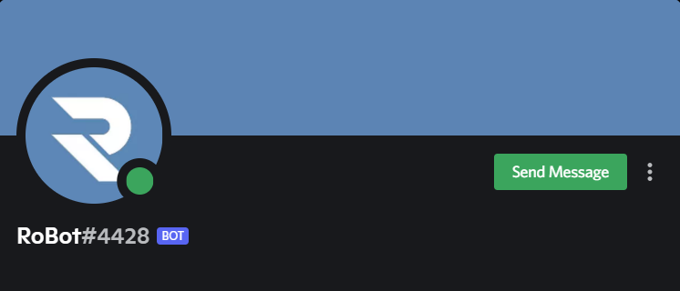

# Introduction

Hello there! Welcome to the official guide for using RoBot, an amazing multipurpose and powerful Discord bot offering a wide variety of features, from posts to tags, from moderation to tickets, in this guide you will learn everything regarding usage of Robot such as and not limited to:
* Posting system
* Ticket system
* Custom commands
* Moderation
* Custom permissions for commands

and more..!

## Before we begin

### RoBot version

Make sure you have the latest version of RoBot in your server, the latest version is currently in verification while the old version of Robot is a verified-discord-bot. However, the old version does not have the latest features like logging and may have many bugs.

The new version of RoBot's tag is **RoBot#4428** and it should look something like this:

If you haven't invited the new Robot to your server yet, use [this link](https://discord.com/oauth2/authorize?client_id=832239654304481312&scope=applications.commands%20bot&permissions=8) to invite it, as both Robots are linked to the same database, you wont lose any progress or settings, if you have both robots in the same server, only the new Robot will reply to your commands. Sounds good? Great!

## Copying IDs
::: warning
RoBot refers to IDs a lot, and if you do not have developer mode on you will not get very far!
:::
Everything in Discord, such as users, channels, messages, emojis, servers, has an ID, an 18-digit number. These numbers make it incredibly 
easy for bots to reference Discord objects, which is why we use them.
**You must turn on Developer Mode** by going to settings -> advanced -> developer mode. Then, when you right click basically anything, you will see a new option of "copy ID". This is what we want!

Make sure to grab your popcorn(jk) and lets start right away!
