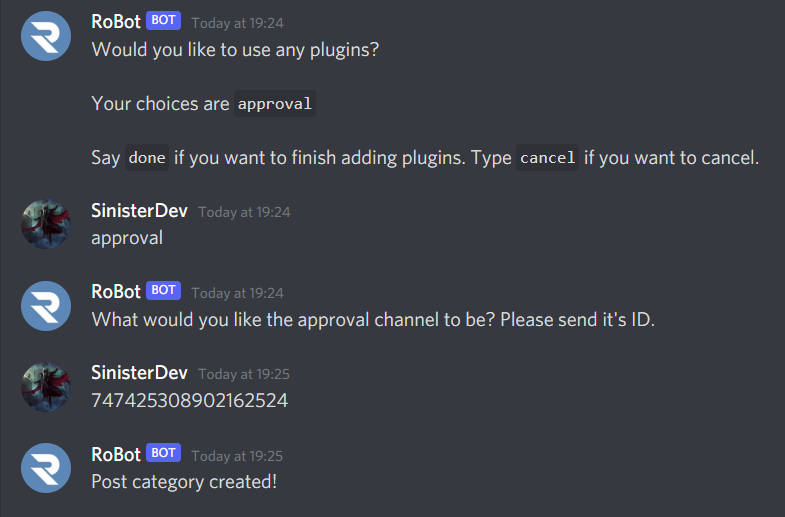

# Plugins

## Role Permissions

There may be times where you want to configure the Posting system so a user with a certain role ("Posting Mute" for example) should not be able to post in a certain category, termed here as "**Blacklists**".  You can also setup a **Greylist**, users with this role cannot post in this category without having a **Whitelisted** role. Greylists are useful when you want only a certain group of users to post in the category:
* Whitelist: The user can post in this category. This overrides graylist, but can be overriden by blacklist.
* Greylist: The user cannot post in this category with this role alone. However, if they have any role that is whitelisted, they can post.
* Blacklist: This user cannot post, no matter what. No matter if their other roles are whitelisted, it is impossible for this user to post. This is helpful for "Posting Mute" roles.

Keep in mind this feature is optional, you may allow everyone to post in the category, however we recommend you make use of this feature.

You can always change or reset permissions later on, read on to learn how...

### Blacklist

Once you have enabled/disabled the Post Category as mentioned in the last page, RoBot should reply asking you to state the Id of the role(s) which should be blacklisted. If you don't want to set a blacklisted role, reply with `none`. If you do want to setup a Blacklist, reply with ID of the Role. If you want to blacklist multiple roles, reply with the Ids separated with a space.

::: tip
How to copy a Role ID: Go into Discord settings > Advanced, turn on Developer Mode. Then right-click the Role(in a Member's profile or in Server Settings) and you should have the option to `Copy ID`
:::

### Whitelist

RoBot should now ask you to state the Id of the role(s) which should be whitelisted. If you don't want to set a whitelisted role, reply with `none`. If you do want to setup a Whitelisted role, reply with ID of the Role. If you want to whitelist multiple roles, reply with the Ids separated with a space as you had done above. To add the @everyone role, send the ID of your server.

::: warning
If you don't setup a whitelisted role, greylists won't be affective as members with greylisted role won't be able to post without a Whitelisted Role
:::

### Greylist

If all done correctly, RoBot will reply asking you to state the Id of the role(s) which should be greylisted. If you don't want to set a greylisted role, reply with `none`. If you do want to setup a Greylisted role, reply with ID of the Role. If you want to greylist multiple roles, reply with the Ids separated with a space as you had done above.

::: tip
When setting up permissions, to work with the `@everyone` role, send the server's Id.
:::

## Fields

RoBot will now ask the number of fields(questions) the post category should have. Reply with the number of fields you want to include for the category.

For each question, RoBot will ask what the question is, and a tip for that question. Add useful tips that explain what the question means, how much to write, and an example answer. **Repeat the process for every question**.

	<discord-message profile="robot">
		How many fields do you want in this category?
	</discord-message>
	<discord-message profile="yankue">
		1
	</discord-message>
    <discord-message profile="robot">
        What should be the question for field #1?
    </discord-message>
	<discord-message profile="yankue">
		Suggestion
	</discord-message>
    <discord-message profile="robot">
        What should be the tips for field #1?
    </discord-message>
    <discord-message profile="yankue">
		What's your suggestion and how does it benefit RoBot users?
	</discord-message>

Example field(question) when someone attempts to post:

<discord-message profile="robot">
	<discord-embed slot="embeds" color="#0064FF" title="Field #1">
		<embed-field title="Suggestion">
			What's your suggestion and how does it benefit RoBot users?
		</embed-field>
	</discord-embed>
</discord-message>

## Approval

Usually, when a user posts, you might want the post to get approved by a Staff or helper before the post getting sent to the main channel. That's where RoBot's approval plugin comes into place. If a user posts in a category where approval plugin is enabled, the post will first be sent to the channel you specify, where a staff may approve the post using the `approve` command.

When RoBot asks you if you would like to add any plugins(and if you wish to add the approval feature for your post category), reply with `approval`, else reply with `done` to finish setting up your Post Category.

RoBot will then ask you which channel the post will be sent in, to get approved by the staff. Send the Channel ID of the channel.

## Finishing Up

Congratulations! You have successfully created a Post Category in your server 🎉 Read on to learn about approving/denying posts and some other cool features.
