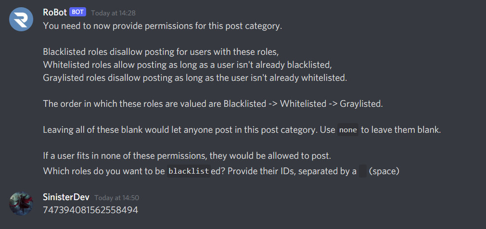

# Plugins

## Role Permissions

There may be times where you want to configure the Posting system so a user with a certain role ("Posting Mute" for example) should not be able to post in a certain category, termed here as "**Blacklists**".  You can also setup a **Greylist**, users with this role cannot post in this category without having a **Whitelisted** role. Greylists are useful when you want only a certain group of users to post in the category:
* Whitelist: The user can post in this category. This overrides graylist, but can be overriden by blacklist.
* Greylist: The user cannot post in this category with this role alone. However, if they have any role that is whitelisted, they can post.
* Blacklist: This user cannot post, no matter what. No matter if their other roles are whitelisted, it is impossible for this user to post. This is helpful for "Posting Mute" roles.

Keep in mind this feature is optional, you may allow everyone to post in the category, however we recommend you make use of this feature.

### Blacklist

Once you have enabled/disabled the Post Category as mentioned in the last page, RoBot should reply asking you to state the Id of the role(s) which should be blacklisted. If you don't want to set a blacklisted role, reply with `none`. If you do want to setup a Blacklist, reply with ID of the Role. If you want to blacklist multiple roles, reply with the Ids separated with a space.

::: tip
How to copy a Role ID: Go into Discord settings > Advanced, turn on Developer Mode. Then right-click the Role(in a Member's profile or in Server Settings) and you should have the option to `Copy ID`
:::

### Whitelist

RoBot should now ask you to state the Id of the role(s) which should be whitelisted. If you don't want to set a whitelisted role, reply with `none`. If you do want to setup a Whitelisted role, reply with ID of the Role. If you want to whitelist multiple roles, reply with the Ids separated with a space as you had done above.

::: warning
If you don't setup a whitelisted role, greylists won't be affective as members with greylisted role won't be able to post without a Whitelisted Role
:::

### Greylist

If all done correctly, RoBot will reply asking you to state the Id of the role(s) which should be greylisted. If you don't want to set a greylisted role, reply with `none`. If you do want to setup a Greylisted role, reply with ID of the Role. If you want to greylist multiple roles, reply with the Ids separated with a space as you had done above.

::: tip
When setting up permissions, to work with the `@everyone` role, send the server's Id.
:::

